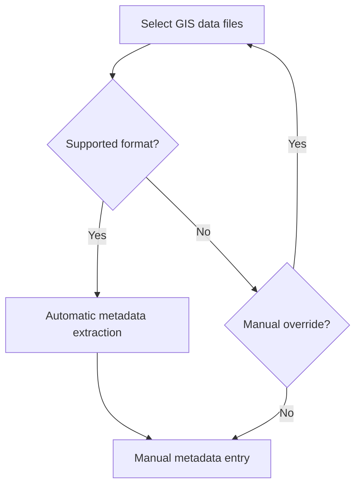

# ekznwr

`ekznwr` provides data-management and GIS utilities for Ezemvelo KZN
Wildlife. It includes tools for scanning and classifying local data
inventories, grouping compound spatial datasets and working with geospatial
archives.

## Installation

`ekznwr` requires R 4.2.0 or later. Install the development version from
[GitHub](https://github.com/ekznw/ekznwr) with `pak`:

```r
install.packages("pak")
pak::pak("ekznw/ekznwr")
```

Alternatively, install it with `remotes`:

```r
install.packages("remotes")
remotes::install_github("ekznw/ekznwr")
```

Then load the package:

```r
library(ekznwr)
```

## Development

To install the package from a local clone:

```r
# Run from the repository root
install.packages(".", repos = NULL, type = "source")
```

Run the test suite with:

```r
testthat::test_local()
```

## GIS metadata workflow


